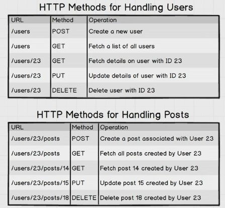
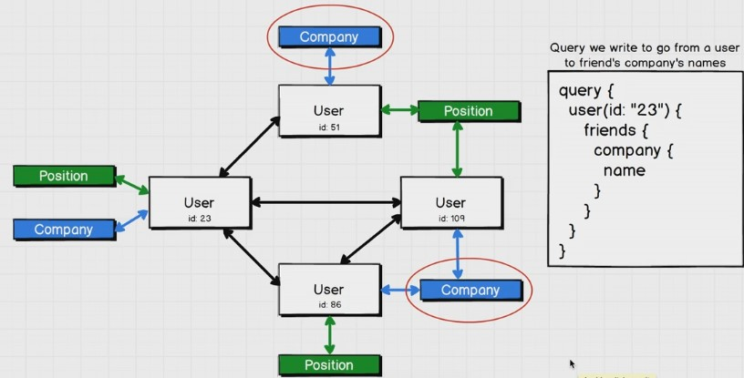
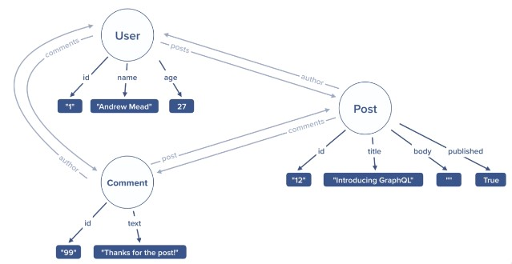
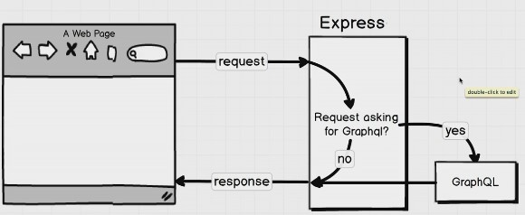
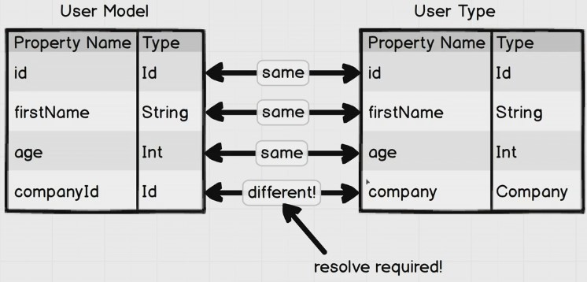
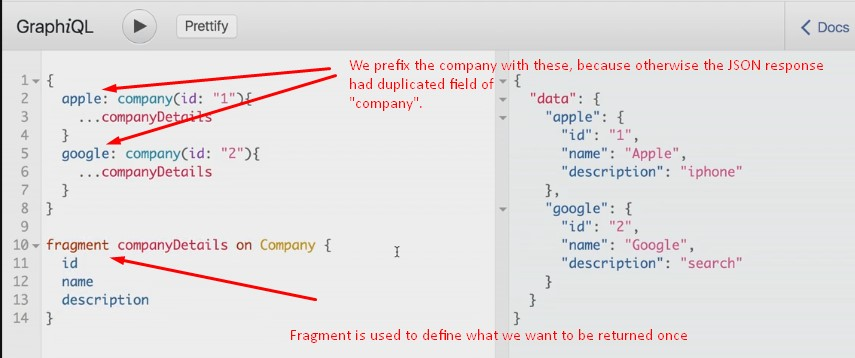
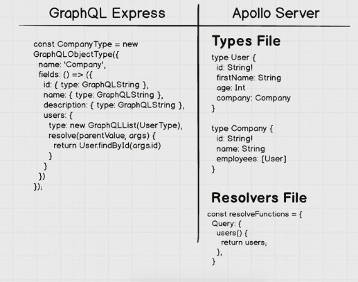
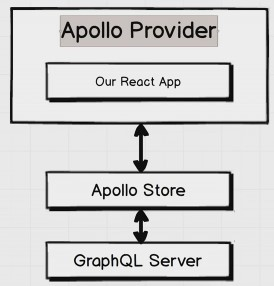
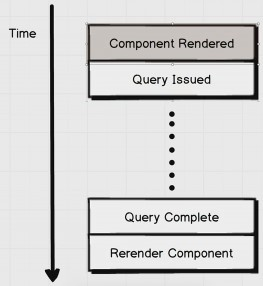
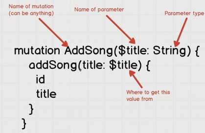

# Introduction

- RESTful convention and designing routes when we are dealing with associated records:



## Shortcomings of RESTful routing

- Sometimes it is not obvious to design a route for a query (give me the companies and positions that friends of a user are working at) -> `users/23/friends/companies` and `users/23/friends/positions`. This is very customized.
- If we don't want to design a complex route for it, then we have to make numerous HTTP calls:
  - One to get list of friends: `/users/23/friends`
  - for any friend, `/users/1/companies` and `/users/1/positions`.
- Another solution is to design a very customized route that **breaks the RESTful** convention: `users/23/friends_with_companies_and_positions`.
- So in short, when working with **highly related data**, either we have to break down the conventions and design highly customized endpoints for our front-end or make too many HTTP requests.
- Even, when serving, we might over-serve the client by data that it doesn't need.

## Graph

- In GraphQL, we start with a node and walk (crawl) through the graph to get what we need:



- GraphQL creates fast and flexible APIs, giving clients complete control to ask for just the data they need:

  - Fewer HTTP requests.
  - Flexible data querying.
  - Less code to manage.

- We define `types` and their fields (things that we want to show to the client) when defining GraphQL APIs.
- All types need to have an `id` field.
- For establishing the relationships between types we define `nav props` for each type which needs a `resolver`.



- `GraphiQL` is something like `postman` but it has just one endpoint (POST /graphql).
- There are three major GraphQL operations we can do on a GraphQL API -> `query`, `mutation`, `subscription`.

## Query

- We specify the fields that can come back from the server (note that there is no comma).
- Actually here there is a rootQuery (query for Andrew is the rootQuery for Stephen) for hello which returns a string and there is one for courseInstructor which also returns a string.
- If a query returns an object (a custom type) or array of objects, we have to select the fields that we want.
- If there is a `!` in the schema, you always get back that type, otherwise you might get `null` as well for that query or field.

```graphql
query {
  hello
  courseInstructor
  me {
    id
    name
  }
  users {
    id
    name
  }
  greeting(name: "Ben")
  grades
  posts {
    id
    title
    author {
      id
      name
    }
  }
  comments {
    ...commentFields
  }
}

fragment commentFields on Comment {
  # reuse selection set
  id
  text
}
```

- GraphQL APIs are self-documented.

### Babel

- To use ES6 import/export in the backend, we wire-up Babel to our node project:

```
npm init
npm i babel-cli babel-preset-env babel-plugin-transform-object-rest-spread
```

- In the root of the project, add `.babelrc` (which is json object to configure babel).

```json
{
  "presets": ["env"],
  "plugins": ["transform-object-rest-spread"]
}
```

- Now we add this script to `package.json` to run things through Babel:

```json
"start": "babel-node src/index.js"
```

- Now we can write:

```js
const msg = "something";
const name = "Ben";
const location = "Sydney";

export { message, name, location as default }; //named export: you can have many
//or
export default location; //default export: you can have one
```

and

```js
import myLocation, { message } from "./myModule"; // the name for default export can be different
```

### Creating your own GraphQL API

- Andrew uses `graphql-yoga` for implementing the server instead of `graphql-express`.
- `server.js` in the root:

```js
import { GraphQLServer, PubSub } from "graphql-yoga";
import { resolvers, fragmentReplacements } from "./resolvers/index";
import prisma from "./prisma";

const pubsub = new PubSub();

const server = new GraphQLServer({
  typeDefs: "./src/schema.graphql", // This is (schema) where type definitions, queries, mutations, subscriptions, and custom types have been defined.
  resolvers, // functions that will be executed for each operation. We will have files for each type definitions -> User, Post, Comment | Mutation, Query, and Subscription. For each type definition, the resolvers are the nav props. For query, they are the rootQueries to enter to the graph.
  context(request) {
    // context by default is the request, but we can set the context to return an object so every resolver method can have access to it. The database is the great candidate to be on the context. So we don't have to import database in every file.
    // we use context as a function instead of object to get access to the request to check for the authorization Bearer
    return {
      pubsub,
      prisma,
      request,
    };
  },
  fragmentReplacements,
});

export { server as default };
```

- `index.js` in the root:

```js
import "@babel/polyfill/noConflict";
import server from "./server";

server.start({ port: process.env.PORT || 4000 }, () => {
  // if you go to localhost:4000, the playground is there
  console.log("The server is up!");
});
```

- To run the server in the `dev` env with `nodemon` (exec is a switch for nodemon to run it through babel-node and not node which is default. ext is a switch to extend watch list):

```json
"start": "nodemon src/index.js --ext js,graphql --exec babel-node",
```

- GraphQL scalar types are **five**: `String`, `Boolean`, `Int`, `Float`, `ID`.
- `!` means non-nullable. If we leave it off, we can return null from the resolver (if the return type was just Float for example).
- `schema.graphql`:

```graphql
# import UserOrderByInput, PostOrderByInput, CommentOrderByInput from './generated/prisma.graphql'
# the line above is actually a real import of the above types to be used in orderBy and is provided by graphql-import library included in yoga server

type Query {
  hello: String!
  gpa: Float
  greeting(name: String): String!
  grades: [Int!]!
  add(numbers: [Float!]!): Float!
  users(
    query: String
    first: Int
    skip: Int
    after: String
    orderBy: UserOrderByInput
  ): [User!]!
  posts(
    query: String
    first: Int
    skip: Int
    after: String
    orderBy: PostOrderByInput
  ): [Post!]!
  myPosts(
    query: String
    first: Int
    skip: Int
    after: String
    orderBy: PostOrderByInput
  ): [Post!]!
  comments(
    first: Int
    skip: Int
    after: String
    orderBy: CommentOrderByInput
  ): [Comment!]!
  me: User!
  post(id: ID!): Post!
}

type Mutation {
  createUser(data: CreateUserInput!): AuthPayload!
  login(data: LoginUserInput!): AuthPayload!
  deleteUser: User!
  updateUser(data: UpdateUserInput!): User!
  createPost(data: CreatePostInput!): Post!
  deletePost(id: ID!): Post!
  updatePost(id: ID!, data: UpdatePostInput!): Post!
  createComment(data: CreateCommentInput!): Comment!
  deleteComment(id: ID!): Comment!
  updateComment(id: ID!, data: UpdateCommentInput!): Comment!
}

type Subscription {
  count: Int!
  comment(postId: ID!): CommentSubscriptionPayload! # subscribe to comments of a particular post
  post: PostSubscriptionPayload!
  myPost: PostSubscriptionPayload!
}

type AuthPayload {
  token: String!
  user: User!
}

input CreateUserInput { # input is a keyword to define an input type. All the fields of an input type must be scalar. It cannot be a `type`, because types cannot be referenced in arguments' list in the above.
  name: String!
  email: String!
  password: String!
}

input LoginUserInput {
  email: String!
  password: String!
}

input UpdateUserInput {
  name: String
  email: String
  password: String
}

input CreatePostInput {
  title: String!
  body: String!
  published: Boolean!
}

input UpdatePostInput {
  title: String
  body: String
  published: Boolean
}

input CreateCommentInput {
  text: String!
  post: ID!
}

input UpdateCommentInput {
  text: String
}

type User {
  id: ID!
  name: String!
  email: String
  password: String!
  posts: [Post!]!
  comments: [Comment!]!
  updatedAt: String! # this is managed by prisma -> here we want to expose it to the client
  createdAt: String!
}

type Post {
  id: ID!
  title: String!
  body: String!
  published: Boolean!
  author: User!
  comments: [Comment!]!
  updatedAt: String!
  createdAt: String!
}

type Comment {
  id: ID!
  text: String!
  author: User!
  post: Post!
  updatedAt: String!
  createdAt: String!
}

enum MutationType { # enum is a special type to define set of constant strings for things that we know ahead of time
  CREATED
  UPDATED
  DELETED
}

type PostSubscriptionPayload {
  mutation: MutationType! # we could use string, but with enum we are limited to these three kind of mutations when publishing
  node: Post
}

type CommentSubscriptionPayload {
  mutation: MutationType!
  node: Comment # to align it with what prisma API sends to nodeJS API
}
```

- Note that we have one method for each query in the schema file above (in the Query type).
- If the schema says that the result of a query is not null, but we don't return something for that field in the resolver (but returning other fields), the result of the query (in graphiQL for example) will be error.
- `Query.js`:

```js
import getUserId from "../utils/getUserId";

const Query = {
  hello() {
    return "Hello world!";
  },
  gpa() {
    return null;
  },
  greeting(parent, args, ctx, info) {
    if (args.name) {
      return `Hi ${args.name}`;
    }

    return "Hi";
  },
  grades() {
    return [1, 2];
  },
  add(parent, args) {
    if (args.numbers.length === 0) {
      return 0;
    }

    return args.numbers.reduce((acc, cur) => {
      return acc + cur;
    });
  },
  users(parent, args, { prisma }, info) {
    const opArgs = {
      // operation arguments to be passed to the prisma query as the first argument
      first: args.first,
      skip: args.skip,
      after: args.after, // after is a string which is the id of a record.
      orderBy: args.orderBy, // is a type like name_ASC
    };

    if (args.query) {
      opArgs.where = {
        OR: [
          {
            name_contains: args.query, // where, OR, name_contains all are from prisma generated queries arguments
          },
          {
            email_contains: args.query, // we should remove this object, because we don't want to search by email (reveal users' emails)
          },
        ],
      };
    }

    return prisma.query.users(opArgs, info); // each prisma.query methods will be called by two args, the input argument for the query (operation arguments) and what we want to be returned (the selection set as string) -> prisma.query.users(null, "{ id name email posts {id title} }").then((data) => {console.log(data)});
    // for the second argument, we can pass nothing (it returns all scalar fields and not related data), string (like above), or an object (the info object is what client has requested to come back).
    // Notice that you can return a promise like here and resolver will wait it to be resolved before sending it to the client.
  },
  myPosts(parent, args, { prisma, request }, info) {
    const userId = getUserId(request);
    const opArgs = {
      first: args.first,
      skip: args.skip,
      after: args.after,
      orderBy: args.orderBy,
      where: {
        author: {
          id: userId,
        },
      },
    };

    if (args.query) {
      opArgs.where.OR = [
        {
          title_contains: args.query,
        },
        {
          body_contains: args.query,
        },
      ];
    }

    return prisma.query.posts(opArgs, info);
  },
  posts(parent, args, { prisma }, info) {
    const opArgs = {
      first: args.first,
      skip: args.skip,
      after: args.after,
      orderBy: args.orderBy, // e.g published_DESC
      where: {
        published: true,
      },
    };

    if (args.query) {
      opArgs.where.OR = [
        {
          title_contains: args.query,
        },
        {
          body_contains: args.query,
        },
      ];
    }

    return prisma.query.posts(opArgs, info);
  },
  comments(parent, args, { prisma }, info) {
    const opArgs = {
      first: args.first,
      skip: args.skip,
      after: args.after,
      orderBy: args.orderBy,
    };

    return prisma.query.comments(opArgs, info);
  },
  me(parent, args, { prisma, request }, info) {
    const userId = getUserId(request);

    return prisma.query.user({
      where: {
        id: userId,
      },
    });
  },
  async post(parent, args, { prisma, request }, info) {
    const userId = getUserId(request, false); // this is why we defined that requireAuth parameter

    const posts = await prisma.query.posts(
      // we are taking advantage of posts (instead of post) to gave access to OR
      {
        where: {
          id: args.id,
          OR: [
            {
              published: true,
            },
            {
              author: {
                id: userId,
              },
            },
          ],
        },
      },
      info
    );

    if (posts.length === 0) {
      throw new Error("Post not found");
    }

    return posts[0];
  },
};

export { Query as default };
```

- To write the relationship resolvers (for example in), `User.js`:
- In these kind of resolvers (nav props), the `parent` argument is very important.

```js
import getUserId from "../utils/getUserId";

const User = {
  // with prisma, we don't need this nav props (prisma can link data without writing these resolvers). You just can have const User = {};. But if we want to add authentication stuff, we should add them
  posts: {
    // to use fragment, instead of posts to be a resolver function, it should be an object with two fields of fragment and resolve.
    fragment: "fragment userId on User { id }",
    resolve(parent, args, { prisma }, info) {
      return prisma.query.posts({
        where: {
          published: true, //this is because we locked down the posts query but we should lock down access via nav props as well
          author: {
            id: parent.id, // this id should be known so we use fragment
          },
        },
      });
    },
  },
  email: {
    // we dont' want email to be accessible by other users, So in the schema it should be nullable and we should write a resolver here for a scalar field.
    fragment: "fragment userId on User { id }", // fragments are to define re-usable selection set.
    resolve(parent, args, { request }, info) {
      const userId = getUserId(request, false);

      if (userId && userId === parent.id) {
        // the problem is that if we don't ask for id, this resolver will return null so we use fragment.
        return parent.email;
      } else {
        return null;
      }
    },
  },
};

export { User as default };
```

- The `index.js` in the `resolvers` folder, we integrate all the resolvers:

```js
import { extractFragmentReplacements } from "prisma-binding";
import Query from "./Query";
import Mutation from "./Mutation";
import Subscription from "./Subscription";
import User from "./User";
import Post from "./Post";
import Comment from "./Comment";

const resolvers = {
  Query,
  Mutation,
  Subscription,
  User,
  Post,
  Comment,
};

const fragmentReplacements = extractFragmentReplacements(resolvers); // add support for fragments

export { resolvers, fragmentReplacements };
```

## Mutation

- With GraphQL, each route for mutation becomes a resolver function. So the true strength of GraphQL is the query part with the nav props (the root queries are also the same as RESTful routing on my humble opinion).
- Operations to change data on the server.
- `Mutation.js`:

```js
import bcrypt from "bcryptjs";
import getUserId from "../utils/getUserId";
import generateToken from "../utils/generateToken";
import hashPassword from "../utils/hashPassword";

const Mutation = {
  async createUser(parent, args, { prisma }, info) {
    const password = await hashPassword(args.data.password);
    const user = await prisma.mutation.createUser({
      data: {
        ...args.data,
        password,
      },
    }); // we can't pass info here. Because what we return is different from prisma. So if we leave the selection set, we get all the scalar values.

    return {
      user,
      token: generateToken(user.id),
    };
  },
  async login(parent, args, { prisma }, info) {
    const user = await prisma.query.user({
      where: {
        email: args.data.email,
      },
    });

    if (!user) {
      throw new Error("Unable to login");
    }

    const isMatch = await bcrypt.compare(args.data.password, user.password);

    if (!isMatch) {
      throw new Error("Unable to login");
    }

    return {
      user,
      token: generateToken(user.id),
    };
  },
  async deleteUser(parent, args, { prisma, request }, info) {
    const userId = getUserId(request);

    return prisma.mutation.deleteUser(
      {
        where: {
          id: userId,
        },
      },
      info
    );
  },
  async updateUser(parent, args, { prisma, request }, info) {
    const userId = getUserId(request);

    if (typeof args.data.password === "string") {
      args.data.password = await hashPassword(args.data.password);
    }

    return prisma.mutation.updateUser(
      {
        where: {
          id: userId,
        },
        data: args.data,
      },
      info
    );
  },
  createPost(parent, args, { prisma, request }, info) {
    const userId = getUserId(request);

    return prisma.mutation.createPost(
      {
        data: {
          title: args.data.title,
          body: args.data.body,
          published: args.data.published,
          author: {
            connect: {
              // this is how we connect to another source
              id: userId,
            },
          },
        },
      },
      info
    );
  },
  async deletePost(parent, args, { prisma, request }, info) {
    const userId = getUserId(request);
    const postExists = await prisma.exists.Post({
      // for prisma.exists we have one method for each resource
      id: args.id,
      author: {
        id: userId,
      },
    });

    if (!postExists) {
      throw new Error("Unable to delete post");
    }

    return prisma.mutation.deletePost(
      {
        where: {
          id: args.id,
        },
      },
      info
    );
  },
  async updatePost(parent, args, { prisma, request }, info) {
    const userId = getUserId(request);
    const postExists = await prisma.exists.Post({
      id: args.id,
      author: {
        id: userId,
      },
    });
    const isPublished = await prisma.exists.Post({
      id: args.id,
      published: true,
    });

    if (!postExists) {
      throw new Error("Unable to update post");
    }

    if (isPublished && args.data.published === false) {
      await prisma.mutation.deleteManyComments({
        where: { post: { id: args.id } },
      });
    }

    return prisma.mutation.updatePost(
      {
        where: {
          // where is an operation arg in prisma to find a unique resource (post here)
          id: args.id,
        },
        data: args.data,
      },
      info
    );
  },
  async createComment(parent, args, { prisma, request }, info) {
    const userId = getUserId(request);
    const postExists = await prisma.exists.Post({
      id: args.data.post,
      published: true,
    });

    if (!postExists) {
      throw new Error("Unable to find post");
    }

    return prisma.mutation.createComment(
      {
        data: {
          text: args.data.text,
          author: {
            connect: {
              id: userId,
            },
          },
          post: {
            connect: {
              id: args.data.post,
            },
          },
        },
      },
      info
    );
  },
  async deleteComment(parent, args, { prisma, request }, info) {
    const userId = getUserId(request);
    const commentExists = await prisma.exists.Comment({
      id: args.id,
      author: {
        id: userId,
      },
    });

    if (!commentExists) {
      throw new Error("Unable to delete comment");
    }

    return prisma.mutation.deleteComment(
      {
        where: {
          id: args.id,
        },
      },
      info
    );
  },
  async updateComment(parent, args, { prisma, request }, info) {
    const userId = getUserId(request);
    const commentExists = await prisma.exists.Comment({
      id: args.id,
      author: {
        id: userId,
      },
    });

    if (!commentExists) {
      throw new Error("Unable to update comment");
    }

    return prisma.mutation.updateComment(
      {
        where: {
          id: args.id,
        },
        data: args.data,
      },
      info
    );
  },
};

export { Mutation as default };
```

- To call the mutation:

```graphql
mutation {
  createUser(data: { name: "Ben", email: "ben@test.com", password: "1234" }) {
    token
    user {
      name
      email
    }
  }
}
```

## Subscription

- GraphQL subscription uses Web Socket behind the scene which keeps an open channel of communication between the client and the server. That means server can send the latest changes to the client in real time. This is super useful for chat apps, notifications, and ordering apps.
- When a new post or comment is created, send it to the client (in essence, subscription is the reversed query).
- `Subscription.js`:

```js
import getUserId from "../utils/getUserId";

const Subscription = {
  count: {
    subscribe(parent, args, { pubsub }, info) {
      // this method runs whenever someone tries to subscribe to count
      let count = 0;

      setInterval(() => {
        count++;
        pubsub.publish("count", { count }); // it has match with the only channel we support RN ("count"). We usually do not publish from the resolver that we set up the subscription; we publish from a mutation for example (when we create a post or comment).
        // What we publish has to be an object with the key of subscription and value which its type matches to the return type of the subscription.
      }, 1000);

      return pubsub.asyncIterator("count"); // the first argument is the channel name to publish to. This line sets up our channel.
    },
  },
  comment: {
    subscribe(parent, { postId }, { prisma }, info) {
      // without prisma, 1. we have to first see the post with that id exists and is published (and throw error otherwise). 2. return pubsub.asyncIterator(`comment ${postId}`); 3. Then in the createComment mutation after saving it to the database, add pubsub.publish(`comment ${args.data.post}`, { comment: { mutation: "CREATED", node: comment } });. We will have similar publishes for deleting and editing.
      // with prisma, we don't need to publish it in the mutations.
      return prisma.subscription.comment(
        {
          where: {
            node: {
              post: {
                id: postId,
              },
            },
          },
        },
        info
      );
    },
  },
  post: {
    subscribe(parent, args, { prisma }, info) {
      return prisma.subscription.post(
        {
          where: {
            node: {
              published: true,
            },
          },
        },
        info
      );
    },
  },
  myPost: {
    // an example of locked-down (behind authentication) subscription
    subscribe(parent, args, { prisma, request }, info) {
      const userId = getUserId(request);

      return prisma.subscription.post(
        {
          where: {
            node: {
              author: {
                id: userId,
              },
            },
          },
        },
        info
      );
    },
  },
};

export { Subscription as default };
```

- To subscribe, we write:

```graphql
subscription {
  # with this, it starts listening
  count
}
```

## Prisma

- If you don not want to use prisma, pass db to the context, get db in the resolvers and talk to the database directly.
- With Prisma, out node server is a middle man between the client and the Prisma server.
- Prisma is like an ORM. It is a server application that needs to be run.
- Postgres (and SQL DBs are excellent choices for GraphQL).
- You can create a free PG DB with Heroku (by installing add-on Heroku-Postgres in your app).
- PGAdmin is a Postgres GUI to connect to the database and manage our data (CRUD). We have to add a server in this tool with the connection strings we have.
- Install Docker on your machine.
- Install `npm i -g prisma`.
- Run `prisma init prisma` which creates a folder called `prisma` in our project and asks some questions about whether to connect to an existing database or create a new one (choose existing) -> then choose the type of `PostegreSQL` and then choose no for availability of existing data. Then it asks the connection data. At the end, it asks to use SSL? and we have to say yes because external connections to Heroku should be SSL. If it asks for programming language to generate client, select do not generate.
- The above step, generates three files in the `prisma` folder (we could have written these files ourselves instead of using prisma init): `datamodel.graphql` (to create the actual database), `docker-compose.yml` (the configuration of how prisma container should be built and connects to the database -> make sure to add `ssl: true` to it if it is not there and remove `schema: schema.graphql`) and `prisma.yml` (prisma endpoint, datamodel that it uses, and if any secrets).
- Then we run prisma in the background `docker-compose up -d`.
- At the end run `prisma deploy` to reflect the prisma latest changes in `datamodel.graphql` in the database (You have to do it every time you change the datamodel).
- So now if you navigate to `localhost:4466` (or the private ip of the container running), you can see a GraphQL playground which is connected to a graphQL API provided by prisma itself.
- Prisma does the heavy lifting for us. All we need to do is define the datamodel, and the prisma will automatically generate all the mutations, queries, and the subscriptions to get everything working with the database we have chosen (by running that `prisma deploy`).
- So in short prisma is a graphQL API server which talks to PostgreSQL or MySQL and you give it a data model and it generates a lot of mutations and queries and in your real backend server you have to only worry about authentication and you talk to prisma server for accessing database so that is why it is like an ORM. Prisma's biggest benefit when writing a GraphQL server is that it saves you huge amounts of CRUD boilerplate that you'd have to write in your resolvers otherwise.
- If there is already some records in the database and you add a non-nullable field in the `datamodel.graphql` below, you have to first wipe out the DB before `prisma deploy`.

```graphql
type User {
  id: ID! @unique # a graphql directive -> makes the field unique -> for ID you have to do it in prisma, otherwise you receive an error
  name: String!
  email: String! @unique
  password: String!
  posts: [Post!]! @relation(name: "PostToUser", onDelete: CASCADE) # This @relation is not necessary -> If left off, the default behavior is that when deleting a user, it tries to set author null in associated records which are non-nullable here and throws error. Whether we use this directive or not, it creates a _PostToUser table in the database to connect these two.
  comments: [Comment!]! @relation(name: "CommentToUser", onDelete: CASCADE)
  updatedAt: DateTime!
  createdAt: DateTime!
}

type Post {
  id: ID! @unique
  title: String!
  body: String!
  published: Boolean!
  author: User! @relation(name: "PostToUser", onDelete: SET_NULL) # the name that we given is not important, it just have to be the same on both side of the relationships
  comments: [Comment!]! @relation(name: "CommentToPost", onDelete: CASCADE)
  updatedAt: DateTime!
  createdAt: DateTime!
}

type Comment {
  id: ID! @unique
  text: String!
  author: User! @relation(name: "CommentToUser", onDelete: SET_NULL)
  post: Post! @relation(name: "CommentToPost", onDelete: SET_NULL)
  updatedAt: DateTime!
  createdAt: DateTime!
}
```

### Integrate prisma into node

- First install `npm i prisma-binding graphql-cli`.
- Add `.graphqlconfig` in the root of the project:

```json
{
  "projects": {
    "prisma": {
      "schemaPath": "src/generated/prisma.graphql", // where we want to save the generated prisma schema file
      "extensions": {
        "endpoints": {
          "default": "http://localhost:4466"
        }
      }
    }
  }
}
```

- Add `"get-schema": "graphql get-schema -p prisma"` to the scripts section of package.json. The `-p` is the name of the project which we only have one `prisma`.
- Run `npm run get-schema`. Whenever we run this script, that generated file will be replaced (after each prisma deploy, run this to update the schema).
- `graphql get-schema` will generate the schema that will be used in the creating prisma client down below.
- `src/prisma.js`:

```js
import { Prisma } from "prisma-binding";
import { fragmentReplacements } from "./resolvers/index";

const prisma = new Prisma({
  typeDefs: "src/generated/prisma.graphql",
  endpoint: process.env.PRISMA_ENDPOINT,
  secret: process.env.PRISMA_SECRET, // this secret must be the same as the one in prisma.yml file in the prisma folder. With this, our prisma client will be closed to public and can interact with only the ones that know the secret. If you want to use the playground on port 4466, you can generate a token by `prisma token` and then add {"Authorization":"Bearer ey..."}
  fragmentReplacements,
});

export { prisma as default };
```

## Authentication

- `utils/getUserId.js`:

```js
import jwt from "jsonwebtoken";

const getUserId = (request, requireAuth = true) => {
  const header = request.request
    ? request.request.headers.authorization // http:
    : request.connection.context.Authorization; // ws: this is where the authorization header is set in case of WS.

  if (header) {
    const token = header.replace("Bearer ", "");
    const decoded = jwt.verify(token, process.env.JWT_SECRET);
    return decoded.userId;
  }

  if (requireAuth) {
    throw new Error("Authentication required");
  }

  return null;
};

export { getUserId as default };
```

- `utils/generateToken.js`:

```js
import jwt from "jsonwebtoken";

const generateToken = (userId) => {
  return jwt.sign({ userId }, process.env.JWT_SECRET, { expiresIn: "7 days" });
};

export { generateToken as default };
```

- `utils/hashPassword.js`:

```js
import bcrypt from "bcryptjs";

const hashPassword = (password) => {
  if (password.length < 8) {
    throw new Error("Password must be 8 characters or longer.");
  }

  return bcrypt.hash(password, 10);
};

export { hashPassword as default };
```

# A project with express-graphql

```
npm i express express-graphql graphql axios
```

- GraphQL is a tiny component of an express application:



- So we write a server like this:

```js
const express = require("express");
const expressGraphQL = require("express-graphql");
const app = express();
const schema = require("./schema/schema");

app.use(
  "/graphql",
  expressGraphQL({
    // it is a middleware that intercepts only to this route
    schema,
    graphiql: true,
  })
);

app.listen(4000, () => {
  console.log("listening");
});
```

- `graphiql` is a dev tool to make queries against our dev server. By navigating to `localhost:4000/graphiql` you can open it. It is provided by `express-graphql` library.
- You can run the queries there and also see the Docs and different types.
- `schema` tells GraphQL about the `types of data` that we are working with and `how they are related` to each other.

```js
const graphql = require("graphql");
const axios = require("axios");
const {
  GraphQLObjectType,
  GraphQLString,
  GraphQLInt,
  GraphQLSchema,
  GraphQLList,
  GraphQLNonNull,
} = graphql;

const UserType = new GraphQLObjectType({
  // for each object type, we have to define, name and fields.
  name: "User",
  fields: () => ({
    // fields can be an object instead of a function that returns an object. But not here, because we have referred to CompanyType which is defined later and in CompanyType we referred to UserType (circular reference) and JS is not happy -> instead of object we define a function which returns an object. So after the entire file is executed then this function will be executed.
    id: { type: GraphQLString },
    firstName: { type: GraphQLString },
    age: { type: GraphQLInt },
    company: {
      // we treat association as a field. Whenever our user model (database) is different from our user type, a resolver needed (see image below.)
      type: CompanyType,
      resolve(parentValue, args) {
        //parentValue is the node that we are already on -> JS object for data model, not data type, so it has companyId. This is the record that is fetched (from db or api).
        // The third argument that can be passed to resolve function is `context` which is the request object.
        return axios
          .get(`http://localhost:3000/companies/${parentValue.companyId}`)
          .then((response) => response.data);
      },
    },
  }),
});

const CompanyType = new GraphQLObjectType({
  name: "Company",
  fields: () => ({
    id: { type: GraphQLString },
    name: { type: GraphQLString },
    description: { type: GraphQLString },
    users: {
      type: new GraphQLList(UserType),
      resolve(parentValue, args) {
        return axios
          .get(`http://localhost:3000/companies/${parentValue.id}/users`) // our api returns employees of a particular company by this route.
          .then((response) => response.data);
      },
    },
  }),
});

const RootQuery = new GraphQLObjectType({
  // the purpose of root query is to jump and land on a specific node.
  name: "RootQueryType",
  fields: {
    user: {
      type: UserType, // this is the return type -> if you ask me a user and pass me his id, I will return a UserType object.
      args: { id: { type: GraphQLString } },
      resolve(parentValue, args) {
        // resolve is where we actually go into our data store (database or REST api (our own or 3rd party)) and look for the data.
        // parentValue is notorious for not being used often.
        // for the root query the parentValue is null.
        return axios
          .get(`http://localhost:3000/users/${args.id}`) // GraphQL will wait for the promise to resolve and then sends the data to express app.
          .then((response) => response.data); // this line is just for getting the data out of axios response.
      },
    },
    company: {
      type: CompanyType,
      args: { id: { type: GraphQLString } },
      resolve(parentValue, args) {
        return axios
          .get(`http://localhost:3000/companies/${args.id}`)
          .then((response) => response.data);
      },
    },
  },
});

const mutation = new GraphQLObjectType({
  name: "Mutation",
  fields: {
    // Naming the mutation, describing its operation
    addUser: {
      // The type of data returned from resolve function- may not be the same type that is mutated
      type: UserType,
      args: {
        // Non null- these fields are required! Otherwise error will be thorwn.
        firstName: { type: new GraphQLNonNull(GraphQLString) },
        age: { type: new GraphQLNonNull(GraphQLInt) },
        companyId: { type: GraphQLString },
      },
      resolve(parentValue, { firstName, age }) {
        return axios
          .post("http://localhost:3000/users", { firstName, age })
          .then((response) => response.data);
      },
    },
    deleteUser: {
      type: UserType,
      args: {
        id: { type: new GraphQLNonNull(GraphQLString) },
      },
      resolve(parentValue, { id }) {
        return axios
          .delete(`http://localhost:3000/users/${id}`)
          .then((response) => response.data);
      },
    },
    editUser: {
      type: UserType,
      args: {
        id: { type: new GraphQLNonNull(GraphQLString) },
        firstName: { type: GraphQLString },
        age: { type: GraphQLInt },
        companyId: { type: GraphQLString },
      },
      resolve(parentValue, args) {
        // Send all args in body- id will be ignored (by our server listening on port 3000)
        return axios
          .patch(`http://localhost:3000/users/${args.id}`, args) // put request would replace but patch only updates the provided fields
          .then((response) => response.data);
      },
    },
  },
});

module.exports = new GraphQLSchema({
  query: RootQuery,
  mutation: mutation,
});
```

- resolve function:



- You can also think of resolve function as an edge in graph. Whenever we want to go from one node to another we need a resolve function which is called with the node data model as parentValue.

## GraphiQL

### Queries

- How to write queries in GraphiQL:

```graphql
{
  user(id: "23") {
    id
    firstName
    age
  }
}
```

and it returns:

```json
{
  "data": {
    "user": {
      "id": "23",
      "firstName": "Bill",
      "age": 20
    }
  }
}
```

- If it doesn't found it, it returns null:

```json
{
  "data": {
    "user": null
  }
}
```

- If we don't provide the args to the root query, we get error messages.

#### Labeling different queries and fragments:

- We are free to ask multiple companies in a single query but we have to label them differently.



- We can also name the query:

```graphql
query fetchUser { // not useful in GraphiQL but very useful in the frontend
  user(id: "23") {
    id
    firstName
    age
  }
}
```

### Mutations

```graphql
mutation {
  addUser(firstName: "Stephen", age: 26) {
    id
    firstName
    age
  }
}
```

## GraphQL Express vs Apollo server



- In GraphQL-Express, we define all the types and its resolvers (for virtual properties) in one place; but in Apollo server, we define them in different files (Apollo server has this fancy syntax for types files).

# Apollo Client

## Apollo with Vanilla JS

- Run `npm init` and then `npm i parcel-bundler --save-dev`. Parcel uses webpack and babel so we can write modern JS.
- Run `npm i apollo-boost graphql`.
- Add `start` script: `parcel src/index`.
- in `src/index.html`:

```html
<!DOCTYPE html>
<html lang="en">
  <head>
    <meta charset="UTF-8" />
    <meta name="viewport" content="width=device-width, initial-scale=1.0" />
    <title>Document</title>
  </head>
  <body>
    <div id="users"></div>
    <script src="./index.js" type="application/javascript"></script>
  </body>
</html>
```

- in `src/index.js`:

```js
import ApolloBoost, { gql } from "apollo-boost";

const client = new ApolloBoost({
  uri: "http://localhost:4000",
});

const getUsers = gql`
  query {
    users {
      id
      name
    }
  }
`;

client
  .query({
    query: getUsers,
  })
  .then((res) => {
    let html = "";

    res.data.users.forEach((user) => {
      html += `
        <div>
          <h3>${user.name}</h3>
        </div>
      `;
    });

    document.getElementById("users").innerHTML = html;
  });
```

## Apollo in React

- To use apollo in our React app, we have to install `apollo-client` to import `ApolloClient` which has no idea of react and interacts with our graphql backend and stores data locally when the response comes back. We also have to install `react-apollo` to import `ApolloProvider` which wraps the react app (it is a glue layer) and talks to `Apollo Store` to get data to our app.



```js
import React from "react";
import ReactDOM from "react-dom";
import ApolloClient from "apollo-client";
import { ApolloProvider } from "react-apollo";

//with no configuration the Apollo client here assumes
// that graphql server is available in the /graphql route
// in the same domain -> because in this project react app is serving by express
const client = new ApolloClient({
  // this line creates an apollo store.
  dataIdFromObject: (o) => o.id, // this line takes every piece of data that is fetched by our Apollo client from the backend and runs it through this function, the result of this function is used to identify that piece of data in the Apollo store -> so use the id to identify the records and if each records is updated, tell React to update itself -> it means that whenever we make a query we should include id (if we want to use this configuration) -> so this is some sort of caching based on id. -> when we create a lyric for a song, because we already fetched the song (we are in the song detail page), if we ask the song back when mutating the song by creating a lyric for it, it automatically updates the list of lyrics and no need for fetching lyrics again.
});

const Root = () => {
  return (
    <ApolloProvider client={client}>
      <div>Hello</div>
    </ApolloProvider>
  );
};

ReactDOM.render(<Root />, document.querySelector("#root"));
```

- If we had `Router`, it will go inside the provider.
- With Apollo, we just have to define the query and then the data will be accessible in the component.
- For example for a `SongList` component:

```js
import React, { Component } from "react";
import gql from "graphql-tag"; // helper to write graphQL queries in component files
import { graphql } from "react-apollo";

class SongList extends Component {
  onSongDelete(id) {
    this.props
      .mutate({
        variables: { id },
      })
      .then(() => this.props.data.refetch()); // data property of props has a refetch function. It refetch all the queries that associated with this component. You can use the method in the next component but this is easier.
  }

  render() {
    if (this.props.data.loading) return <div>Loading ...</div>; // it is important because otherwise this.props.data.songs is undefined. loading flag is added by graphql.

    return (
      <div>
        <h3>Song List</h3>
        <ul className="collection">
          {this.props.data.songs.map((song) => (
            <li key={song.id} className="collection-item">
              <Link to={`songs/${song.id}`}>{song.title}</Link>
              <i
                className="material-icons"
                onClick={() => this.onSongDelete(song.id)}
              >
                delete
              </i>
            </li>
          ))}
        </ul>
        <Link to="/songs/new" className="btn-floating btn-large red right">
          <i className="material-icons">add</i>
        </Link>
      </div>
    );
  }
}

// it is just the query, the query won't be executed.
const query = gql`
  {
    songs {
      id
      title
    }
  }
`;

const mutation = gql`
  mutation DeleteSong($id: ID) {
    deleteSong(id: $id) {
      id
    }
  }
`;

export default graphql(mutation)(graphql(query)(SongList)); // this call (the inner graphql(query)), executes the query and gives the response in data property of props to the component.
```



- For creating a song, we will create a component and define the mutation in there too:

```js
import React, { Component } from "react";
import { Link, hashHistory } from "react-router";
import { graphql } from "react-apollo";
import gql from "graphql-tag";
import query from "../queries/fetchSongs";

class SongCreate extends Component {
  constructor(props) {
    super(props);

    this.state = { title: "" }; // initialize state in class component (the old way)
  }

  onSubmit(event) {
    event.preventDefault();

    this.props
      .mutate({
        variables: { title: this.state.title }, // the title is the name of the query variable without the $.
        refetchQueries: [{ query }], // Because we are going to the list of songs and if we are starting from the song list, because GraphQL already ran query of fetching songs, it won't do it again (Apollo store won't be updated). So we have to refetch the query. If we started from create song page, it would show the correct list. So we will take the query of the previous component in a separate file and import it here and there. If the query needed some number of variables: refetchQueries: [{ query, variables: {...} }]. Here the query is associated with another component and we cannot use this.props.data.refetch().
      })
      .then(() => hashHistory.push("/"));
  }

  render() {
    return (
      <div>
        <Link to="/">Back</Link>
        <h3>Create a new song</h3>
        <form onSubmit={this.onSubmit.bind(this)}>
          <label>Song Title:</label>
          <input
            onChange={(event) => this.setState({ title: event.target.value })}
            value={this.state.title}
          />
        </form>
      </div>
    );
  }
}

// when writing mutation in GraphiQL, we wrote:
// mutation {
//   addSong(title: "something") {
//     title
//   }
// }
// But here we don't have the title yet, so we give the mutation a name (which is not important) which receives a title as a variable (it is called query variables)
const mutation = gql`
  mutation AddSong($title: String) {
    addSong(title: $title) {
      title
    }
  }
`;

export default graphql(mutation)(SongCreate); // this call populates the mutate property (a function) of props.
```



- To see details of a song:

```js
import React, { Component } from "react";
import { Link } from "react-router";
import { graphql } from "react-apollo";
import gql from "graphql-tag";

import LyricList from "./LyricList";
import LyricCreate from "./LyricCreate";

class SongDetail extends Component {
  render() {
    const { song } = this.props.data;

    if (!song) {
      return <div>Loading ...</div>;
    }

    return (
      <div>
        <Link to="/">Back</Link>
        <h3>{song.title}</h3>
        <LyricList lyrics={song.lyrics} />
        <LyricCreate
          songId={
            song.id // the id is present in the props.parmas.id of this component which is a direct child of router. So we have to pass it down to this child.
          }
        />
      </div>
    );
  }
}

const query = gql`
  query SongQuery($id: ID!) {
    song(id: $id) {
      id
      title
      lyrics {
        id
        content
        likes
      }
    }
  }
`;

export default graphql(query, {
  // we need to pass the id of the current page to this query (because queries are executed automatically unlike mutations that we invoke manually with proper arguments); so we pass a second object.
  options: (props) => {
    // graphql can intercept the props that are going to go in SongDetail component.
    variables: {
      id: props.params.id;
    }
  },
})(SongDetail);
```

- With Apollo, we can do optimistic mutations by adding `optimisticResponse` property to mutate and give the response that we are expecting to receive from graphQL server (we can copy and paste from the network tab to get an idea):

```js
onLike(id, likes) {
    this.props.mutate({
      variables: { id },
      optimisticResponse: {
        __typeName: 'Mutation',
        likeLyric: {
          id,
          __typeName: 'LyricType',
          likes: likes + 1
        }
      }
    });
  }
```

# Authentication

- With authentication, we have three mutations of `signup`, `login`, and `logout` and one type of `user`.
- Here, auth is done by `passport.js` which I omitted.

```js
const UserType = new GraphQLObjectType({
  name: "UserType",
  fields: {
    id: { type: GraphQLID },
    email: { type: GraphQLString },
  },
});

const RootQueryType = new GraphQLObjectType({
  name: "RootQueryType",
  fields: {
    user: {
      type: UserType,
      resolve(parentValue, args, req) {
        return req.user;
      },
    },
  },
});

const mutation = new GraphQLObjectType({
  name: "Mutation",
  fields: {
    signup: {
      type: UserType,
      args: {
        email: { type: GraphQLString },
        password: { type: GraphQLString },
      },
      resolve(parentValue, { email, password }, req) {
        return AuthService.signup({ email, password, req });
      },
    },
    logout: {
      type: UserType,
      resolve(parentValue, args, req) {
        const { user } = req;
        req.logout();
        return user;
      },
    },
    login: {
      type: UserType,
      args: {
        email: { type: GraphQLString },
        password: { type: GraphQLString },
      },
      resolve(parentValue, { email, password }, req) {
        return AuthService.login({ email, password, req });
      },
    },
  },
});
```

- In the React side;

```js
import React from "react";
import ReactDOM from "react-dom";
import ApolloClient, { createNetworkInterface } from "apollo-client";
import { ApolloProvider } from "react-apollo";
import { Router, hashHistory, Route, IndexRoute } from "react-router";

import App from "./components/App";
import LoginForm from "./components/LoginForm";
import SignupForm from "./components/SignupForm";
import Dashboard from "./components/Dashboard";
import requireAuth from "./components/requireAuth";

const networkInterface = createNetworkInterface({
  uri: "/graphql",
  opts: {
    credentials: "same-origin", // by default, ApolloClient does not send the cookies to the server. With this we send the cookies which has authentication stuff.
  },
});

const client = new ApolloClient({
  networkInterface,
  dataIdFromObject: (o) => o.id,
});

const Root = () => {
  return (
    <ApolloProvider client={client}>
      <Router history={hashHistory}>
        <Route path="/" component={App}>
          <Route path="login" component={LoginForm} />
          <Route path="signup" component={SignupForm} />
          <Route path="dashboard" component={requireAuth(Dashboard)} />
        </Route>
      </Router>
    </ApolloProvider>
  );
};

ReactDOM.render(<Root />, document.querySelector("#root"));
```

- After login is successful, if we redirects the user to the dashboard in `.then`, there will be a race between `refetchQueries` and whatever in `.then`. So because when we update a query all the components associated with the query (meaning graphql(query)) will be updated, we will we redirect the user in `componentWillUpdate`.

```js
import React, { Component } from "react";
import { hashHistory } from "react-router";
import { graphql } from "react-apollo";

import AuthForm from "./AuthForm";
import mutation from "../mutations/Login";
import query from "../queries/CurrentUser";

class LoginForm extends Component {
  constructor(props) {
    super(props);

    this.state = { errors: [] };
  }

  componentWillUpdate(nextProps) {
    // this.props -- Current props
    // nextProps -- Incoming/new props...
    if (!this.props.data.user && nextProps.data.user) {
      // User has logged in...
      hashHistory.push("/dashboard");
    }
  }

  onSubmit({ email, password }) {
    this.props
      .mutate({
        variables: { email, password },
        refetchQueries: [{ query }],
      })
      .catch((res) => {
        const errors = res.graphQLErrors.map((error) => error.message);
        this.setState({ errors });
      });
  }

  render() {
    return (
      <div>
        <h4>Login</h4>
        <AuthForm
          errors={this.state.errors}
          onSubmit={this.onSubmit.bind(this)}
        />
      </div>
    );
  }
}

export default graphql(query)(graphql(mutation)(LoginForm));
```

- For the protected routes, we can use `requireAuth` HOC that is used in the `index.js` above:

```js
import React, { Component } from "react";
import { graphql } from "react-apollo";
import { hashHistory } from "react-router";

import currentUserQuery from "../queries/CurrentUser";

export default (WrappedComponent) => {
  class RequireAuth extends Component {
    componentWillUpdate(nextProps) {
      //don't use componentDidMount by mistake.
      if (!nextProps.data.loading && !nextProps.data.user) {
        hashHistory.push("/login");
      }
    }

    render() {
      return <WrappedComponent {...this.props} />;
    }
  }

  return graphql(currentUserQuery)(RequireAuth);
};
```
